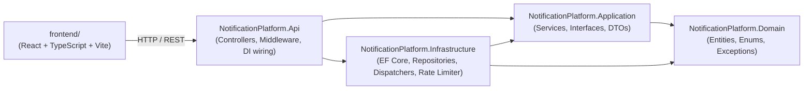
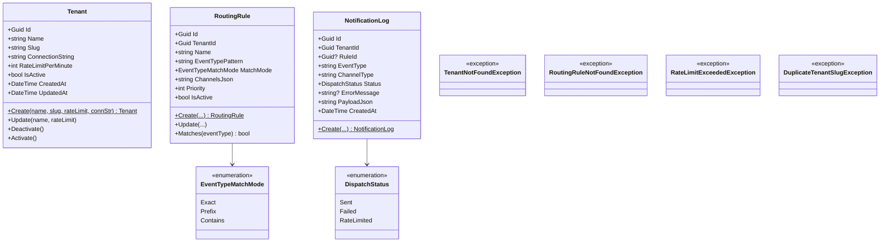
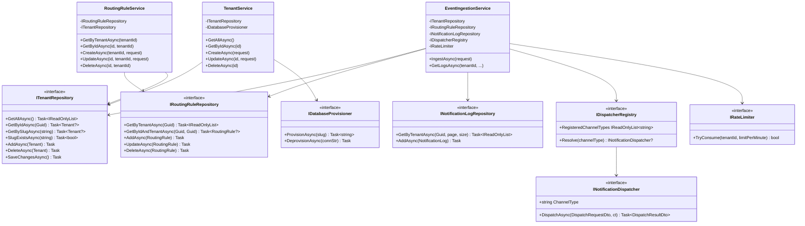
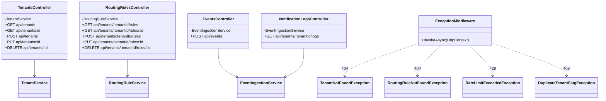
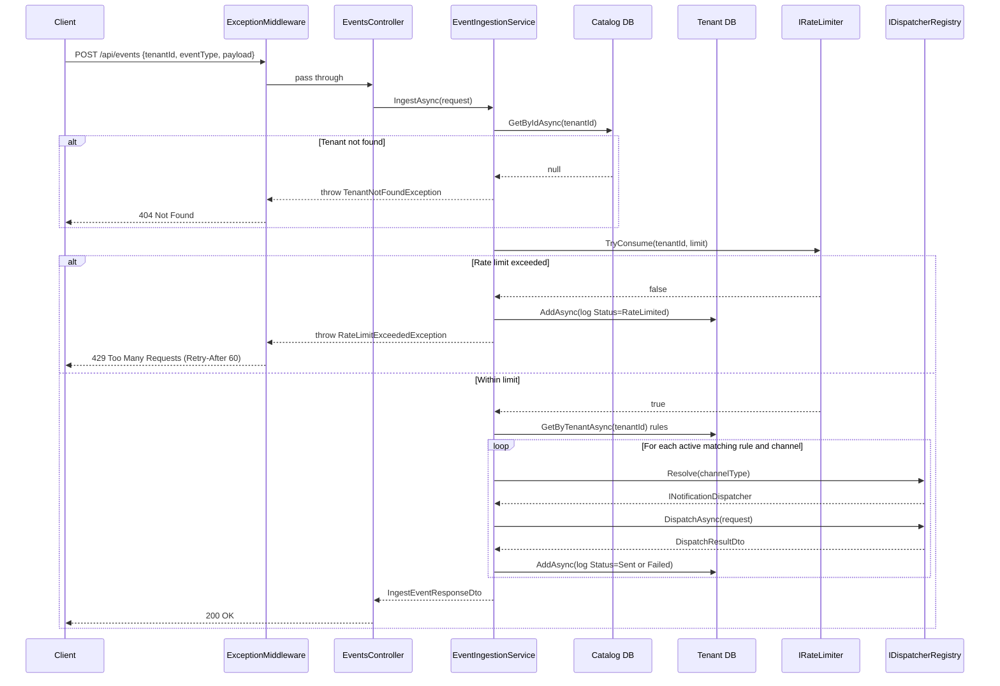

# Architecture — Multi-Tenant Notification Platform

Pre-rendered PDFs of every diagram are in [docs/](docs/). The Mermaid source files (`.mmd`) are alongside them if you want to regenerate.

| Diagram | PDF | Description |
|---|---|---|
| Project Dependency Flow | [01-project-dependency-flow.pdf](docs/01-project-dependency-flow.pdf) | How the five projects depend on each other |
| Domain Layer | [02-domain-layer.pdf](docs/02-domain-layer.pdf) | Entities, enums, and domain exceptions |
| Application Layer | [03-application-layer.pdf](docs/03-application-layer.pdf) | Interfaces, services, and DTOs |
| Infrastructure Layer | [04-infrastructure-layer.pdf](docs/04-infrastructure-layer.pdf) | EF Core, repositories, dispatchers, rate limiter |
| API Layer | [05-api-layer.pdf](docs/05-api-layer.pdf) | Controllers, routes, and exception middleware |
| Event Ingestion Flow | [06-event-ingestion-flow.pdf](docs/06-event-ingestion-flow.pdf) | End-to-end sequence for `POST /api/events` |

---

## Project Dependency Flow

The solution follows Clean Architecture. Arrows indicate "depends on."

---

## Domain Layer

Zero external dependencies. Pure entities, enums, and domain exceptions.

_`Tenant` has no navigation properties to `RoutingRule` or `NotificationLog` — those entities live in a physically separate per-tenant database._

---

## Application Layer

Defines the contracts (interfaces) and orchestrates business logic (services). No infrastructure dependencies.

---

## Infrastructure Layer

Implements the Application interfaces. Split into two EF contexts: `CatalogDbContext` (static connection) and `AppDbContext` (per-tenant connection resolved at runtime).

```mermaid
classDiagram
    class CatalogDbContext {
        +DbSet~Tenant~ Tenants
        #OnModelCreating(ModelBuilder)
    }
    class AppDbContext {
        +DbSet~RoutingRule~ RoutingRules
        +DbSet~NotificationLog~ NotificationLogs
        #OnModelCreating(ModelBuilder)
    }
    class AppDbContextFactory {
        <<IDesignTimeDbContextFactory>>
        +CreateDbContext(args) AppDbContext
    }
    class TenantDbContextFactory {
        -CatalogDbContext _catalog
        -IMemoryCache _cache
        +CreateAsync(tenantId) Task~AppDbContext~
        +InvalidateCache(tenantId)
    }
    class DatabaseProvisioner {
        -IConfiguration _config
        +ProvisionAsync(slug) Task~string~
        +DeprovisionAsync(connStr) Task
    }
    class TenantMigrationRunner {
        <<IHostedService>>
        +StartAsync(ct) Task
    }
    class TenantRepository {
        -CatalogDbContext _catalog
    }
    class RoutingRuleRepository {
        -TenantDbContextFactory _factory
    }
    class NotificationLogRepository {
        -TenantDbContextFactory _factory
    }
    class LogDispatcher {
        +ChannelType = "log"
        +DispatchAsync(request, ct)
    }
    class WebhookDispatcher {
        +ChannelType = "webhook"
        +DispatchAsync(request, ct)
    }
    class DispatcherRegistry {
        -Dictionary~string,INotificationDispatcher~ _map
        +Resolve(channelType)
    }
    class SlidingWindowRateLimiter {
        -ConcurrentDictionary~Guid,Queue~DateTime~~ _windows
        +TryConsume(tenantId, limit)
    }

    TenantRepository ..|> ITenantRepository : implements
    RoutingRuleRepository ..|> IRoutingRuleRepository : implements
    NotificationLogRepository ..|> INotificationLogRepository : implements
    DatabaseProvisioner ..|> IDatabaseProvisioner : implements
    LogDispatcher ..|> INotificationDispatcher : implements
    WebhookDispatcher ..|> INotificationDispatcher : implements
    DispatcherRegistry ..|> IDispatcherRegistry : implements
    SlidingWindowRateLimiter ..|> IRateLimiter : implements

    TenantRepository --> CatalogDbContext
    TenantDbContextFactory --> CatalogDbContext
    RoutingRuleRepository --> TenantDbContextFactory
    NotificationLogRepository --> TenantDbContextFactory
    TenantDbContextFactory ..> AppDbContext : creates
    TenantMigrationRunner --> CatalogDbContext
    TenantMigrationRunner ..> AppDbContext : migrates per tenant
    DispatcherRegistry --> INotificationDispatcher
```

---

## API Layer

ASP.NET Core controllers and middleware. Depends on Application services directly; Infrastructure is wired via DI in `Program.cs`.

---

## Event Ingestion Request Flow

End-to-end flow for `POST /api/events`. The catalog is hit once per request (5-min cached); the tenant DB handles rules and log writes.

