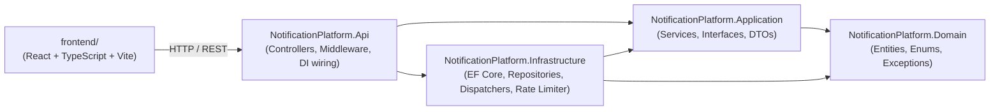
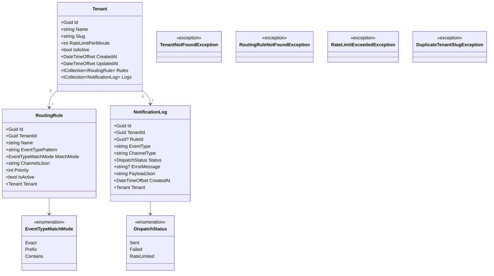
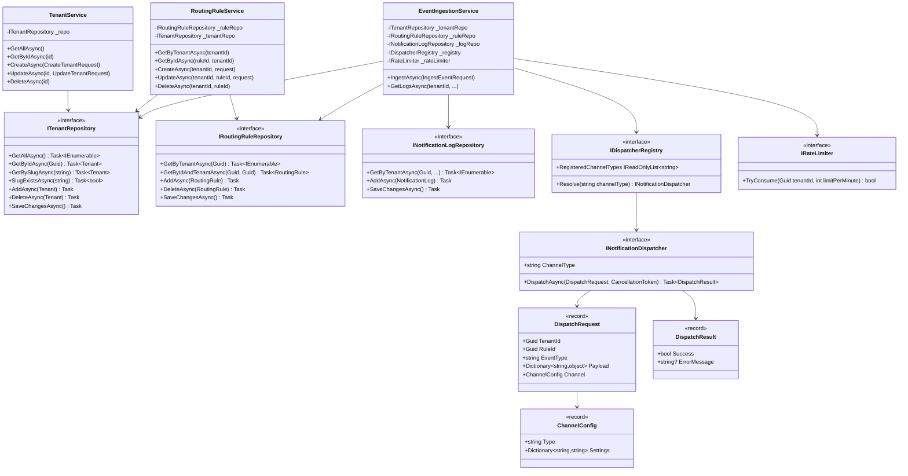
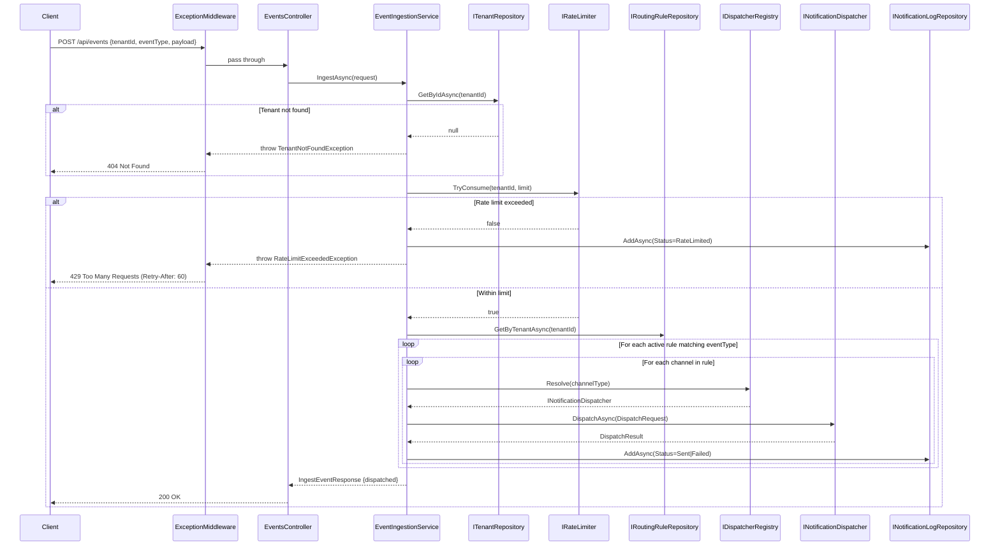

# Design Document — Multi-Tenant Notification Platform

## Architecture Diagrams

### Project Dependency Flow

The solution follows Clean Architecture. Arrows indicate "depends on."



---

### Domain Layer

Zero external dependencies. Pure entities, enums, and domain exceptions.



---

### Application Layer

Defines the contracts (interfaces) and orchestrates business logic (services). No infrastructure dependencies.



---

### Infrastructure Layer

Implements the Application interfaces. All EF Core, HTTP, and in-memory concerns live here.

```mermaid
classDiagram
    class AppDbContext {
        +DbSet~Tenant~ Tenants
        +DbSet~RoutingRule~ RoutingRules
        +DbSet~NotificationLog~ NotificationLogs
        #OnModelCreating(ModelBuilder)
    }
    class TenantConfiguration {
        <<IEntityTypeConfiguration>>
    }
    class RoutingRuleConfiguration {
        <<IEntityTypeConfiguration>>
    }
    class NotificationLogConfiguration {
        <<IEntityTypeConfiguration>>
    }
    class TenantRepository {
        -AppDbContext _db
    }
    class RoutingRuleRepository {
        -AppDbContext _db
    }
    class NotificationLogRepository {
        -AppDbContext _db
    }
    class LogDispatcher {
        -ILogger _logger
        +ChannelType = "log"
        +DispatchAsync(request, ct)
    }
    class WebhookDispatcher {
        -IHttpClientFactory _httpClientFactory
        -ILogger _logger
        +ChannelType = "webhook"
        +DispatchAsync(request, ct)
    }
    class DispatcherRegistry {
        -Dictionary~string,INotificationDispatcher~ _map
        +Resolve(channelType)
        +RegisteredChannelTypes
    }
    class SlidingWindowRateLimiter {
        -ConcurrentDictionary~Guid,Queue~DateTime~~ _windows
        +TryConsume(tenantId, limitPerMinute)
    }

    TenantRepository ..|> ITenantRepository : implements
    RoutingRuleRepository ..|> IRoutingRuleRepository : implements
    NotificationLogRepository ..|> INotificationLogRepository : implements
    LogDispatcher ..|> INotificationDispatcher : implements
    WebhookDispatcher ..|> INotificationDispatcher : implements
    DispatcherRegistry ..|> IDispatcherRegistry : implements
    SlidingWindowRateLimiter ..|> IRateLimiter : implements

    TenantRepository --> AppDbContext
    RoutingRuleRepository --> AppDbContext
    NotificationLogRepository --> AppDbContext
    AppDbContext --> TenantConfiguration
    AppDbContext --> RoutingRuleConfiguration
    AppDbContext --> NotificationLogConfiguration
    DispatcherRegistry --> INotificationDispatcher
```



---

### API Layer

ASP.NET Core controllers and middleware. Depends on Application services directly; Infrastructure is wired via DI in `Program.cs`.

```mermaid
classDiagram
    class TenantsController {
        -TenantService _tenantService
        +GET /api/tenants
        +GET /api/tenants/{id}
        +POST /api/tenants
        +PUT /api/tenants/{id}
        +DELETE /api/tenants/{id}
    }
    class RoutingRulesController {
        -RoutingRuleService _ruleService
        +GET /api/tenants/{tenantId}/rules
        +GET /api/tenants/{tenantId}/rules/{ruleId}
        +POST /api/tenants/{tenantId}/rules
        +PUT /api/tenants/{tenantId}/rules/{ruleId}
        +DELETE /api/tenants/{tenantId}/rules/{ruleId}
    }
    class EventsController {
        -EventIngestionService _ingestionService
        +POST /api/events
    }
    class NotificationLogsController {
        -EventIngestionService _ingestionService
        +GET /api/tenants/{tenantId}/logs
    }
    class ExceptionMiddleware {
        -RequestDelegate _next
        -ILogger _logger
        +InvokeAsync(HttpContext)
    }

    TenantsController --> TenantService
    RoutingRulesController --> RoutingRuleService
    EventsController --> EventIngestionService
    NotificationLogsController --> EventIngestionService
    ExceptionMiddleware ..> TenantNotFoundException : maps to 404
    ExceptionMiddleware ..> RoutingRuleNotFoundException : maps to 404
    ExceptionMiddleware ..> RateLimitExceededException : maps to 429
    ExceptionMiddleware ..> DuplicateTenantSlugException : maps to 409
```

---

### Event Ingestion Request Flow

End-to-end flow for `POST /api/events`.



---

## Data Model

### Entities

**Tenant**

- `Id` (Guid PK), `Name`, `Slug` (unique, lowercase), `RateLimitPerMinute`, `IsActive`, `CreatedAt`, `UpdatedAt`
- Slug is the human-readable identifier used in API URLs and docs.

**RoutingRule**

- `Id`, `TenantId` (FK → Tenant), `Name`, `EventTypePattern`, `MatchMode` (enum), `ChannelsJson` (JSON column), `Priority`, `IsActive`, `CreatedAt`, `UpdatedAt`
- Channels are stored as JSON (`nvarchar(max)`) rather than a separate table. This avoids a join on every event ingestion and lets the channel schema evolve (new channel types, new settings fields) without schema migrations. The trade-off is that you can't query `WHERE channel.type = 'webhook'` without JSON path syntax — acceptable for this use case since channels are always loaded with the rule.

**NotificationLog**

- `Id`, `TenantId` (FK), `RuleId` (nullable FK), `EventType`, `ChannelType`, `Status` (Sent/Failed/RateLimited), `ErrorMessage`, `PayloadJson`, `CreatedAt`
- Append-only audit log. No updates, no deletes (except cascade from tenant delete).

### Relationships

```
Tenant 1──* RoutingRule
Tenant 1──* NotificationLog
```

Cascade delete is configured so that deleting a tenant removes all their rules and logs atomically — this is the "clean slate" expectation and avoids orphan rows.

### Where Tenant Scoping Lives

Every repository method that retrieves data includes `TenantId` in the WHERE clause. The rule of thumb: **a rule ID alone is never sufficient** — `GetByIdAndTenantAsync(ruleId, tenantId)` is the pattern everywhere. This is enforced in code and verified by integration tests.

---

## Isolation Strategy

**Chosen: Shared database with `TenantId` column (Row-Level Scoping)**

Every table carries a `TenantId` column. All repository queries filter by it. Entity Framework configurations add composite indexes (`TenantId + IsActive`, `TenantId + CreatedAt`) to keep cross-tenant reads from degrading performance even at scale.

**What I considered:**

| Strategy                      | Pros                                                            | Cons                                                                                |
| ----------------------------- | --------------------------------------------------------------- | ----------------------------------------------------------------------------------- |
| Shared DB + `TenantId` column | Simple, one schema to migrate, scales to many tenants           | Must be disciplined about filtering in every query; no DB-level enforcement         |
| Schema-per-tenant             | DB enforces isolation by schema, easy to dump one tenant's data | Much harder migrations, max ~100 schemas practical in SQL Server                    |
| Database-per-tenant           | Full isolation, trivial to offboard a tenant                    | Operational explosion; connection string management at scale is a product in itself |

**Why this one wins for this scope:** The project has one developer, a 2–4hr budget, and needs to be defensible in code review. Row-level scoping keeps the schema simple and all isolation logic visible in one place (the repositories). The integration tests demonstrate that the filtering holds — a reviewer can read `GetByIdAndTenantAsync` and understand the isolation guarantee in one line.

**Known gap:** SQL Server Row-Level Security (RLS) policies could enforce isolation at the database engine level, preventing a future developer from accidentally writing an unscoped query. With more time I would add RLS as a defense-in-depth layer on top of the code-level filtering.

---

## Rate Limiting

**Algorithm: Sliding Window (per tenant, global)**

Each tenant gets their own independent window. The `SlidingWindowRateLimiter` maintains a `Queue<DateTime>` of request timestamps per tenant in a `ConcurrentDictionary`. On each request:

1. Evict timestamps older than 60 seconds.
2. If `queue.Count >= limit` → reject (return `false`).
3. Otherwise enqueue now and allow.

**Why sliding window over fixed window?**  
Fixed window has a "burst at boundary" problem: a tenant can fire 2× their limit in a short window by loading the tail of one window and the head of the next. Sliding window prevents that. Token bucket would also work and is slightly more forgiving of burst traffic, but sliding window is simpler to reason about and audit.

**Granularity: global per tenant**  
The limit applies to all events from a tenant regardless of event type or channel. Per-event-type or per-channel granularity would give tenants more flexibility but would require a more complex key scheme and makes the limit less predictable to reason about. Given this is a 2–4hr project, global-per-tenant is the right call.

**Where state is stored:** In-memory (`ConcurrentDictionary`). The window is accurate within a single process.

**Trade-off documented:** In-memory state is not shared across instances. In a horizontally-scaled deployment, each instance maintains its own window, meaning a tenant could exceed their limit by a factor equal to the replica count. Fixing this requires a distributed counter (Redis `INCR` with expiry, or an atomic sliding window in Redis Lua). I've documented this in the README's Known Limitations section.

**What happens at the limit:** The ingestion endpoint returns `429 Too Many Requests` with a `Retry-After: 60` header. The rejection is logged as a `NotificationLog` with `Status = RateLimited` so tenants can observe their own throttling.

---

## Dispatcher Abstraction

### Interface

```csharp
public interface INotificationDispatcher
{
    string ChannelType { get; }
    Task<DispatchResult> DispatchAsync(DispatchRequest request, CancellationToken ct = default);
}
```

`DispatchRequest` carries `TenantId`, `RuleId`, `EventType`, `Payload`, and the `ChannelConfig` (type + settings dictionary). The dispatcher receives everything it needs to render and send the notification — it has no dependency on the domain layer.

### How a new channel is added

1. Implement `INotificationDispatcher` in `Infrastructure/Dispatchers/`.
2. Register it in `DependencyInjection.cs`: `services.AddScoped<INotificationDispatcher, MyNewDispatcher>()`.

That's it. The `DispatcherRegistry` discovers all registered `INotificationDispatcher` implementations automatically via `IEnumerable<INotificationDispatcher>` injection and builds a type→dispatcher map. The routing engine (`EventIngestionService`) calls `_registry.Resolve(channelType)` and is completely unaware of what dispatchers exist.

### Current implementations

| Channel Type | Behavior                                                                          |
| ------------ | --------------------------------------------------------------------------------- |
| `log`        | Structured log line via `ILogger` — visible in Docker logs and any log aggregator |
| `webhook`    | HTTP POST to a configured URL; supports custom headers in `Settings`              |

### Adding email (example)

```csharp
public class EmailDispatcher(ISmtpClient smtp) : INotificationDispatcher
{
    public string ChannelType => "email";
    public async Task<DispatchResult> DispatchAsync(DispatchRequest request, CancellationToken ct)
    {
        var to = request.Channel.Settings["to"];
        // ... send email
        return DispatchResult.Ok();
    }
}
```

Register in DI. No other files change.

---

## Known Limitations & Next Steps

- **Rate limiter is in-memory**: distributed deployments need Redis.
- **No authentication**: `tenant_id` in the request body is not production-safe.
- **Webhook retries**: currently no retry logic on failed POSTs — an exponential backoff queue (Hangfire, background worker) would be needed.
- **Rule conditions**: the current model supports event type matching only. A payload field condition engine (e.g. `payload.severity == "critical"`) would make rules much more powerful.
- **Soft delete vs. hard delete for tenants**: currently a hard delete cascades everything. A soft-delete approach with data retention period would be more production-appropriate.
